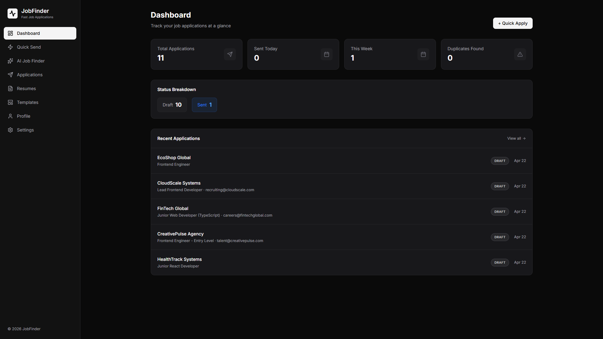
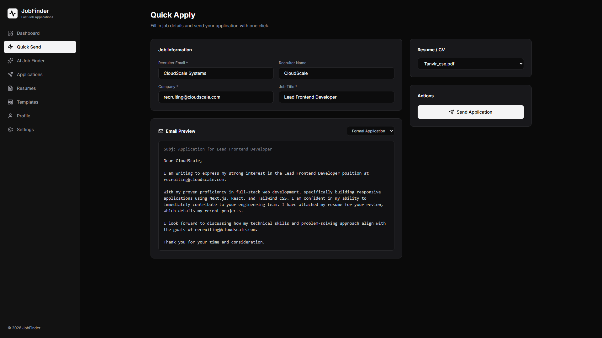
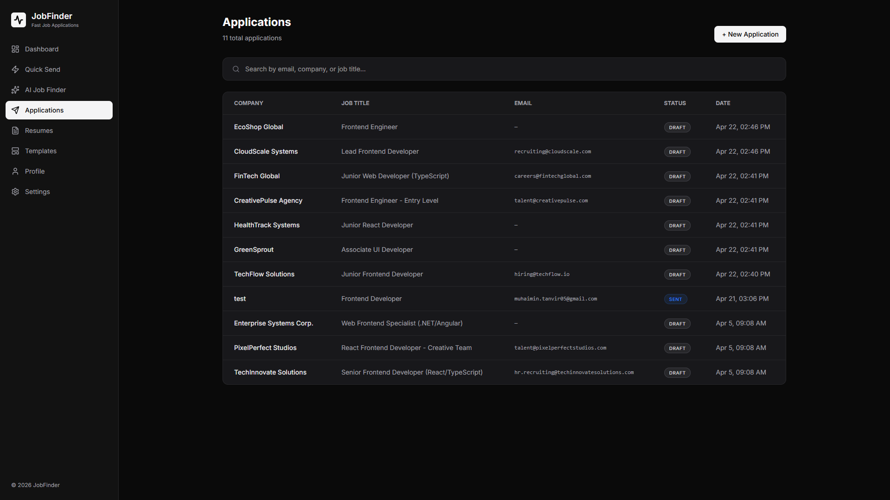
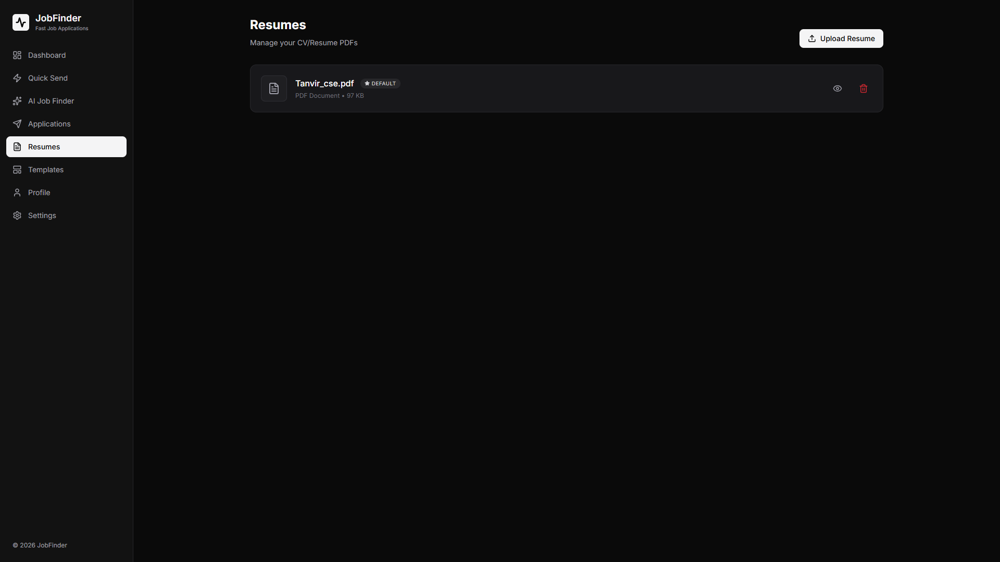
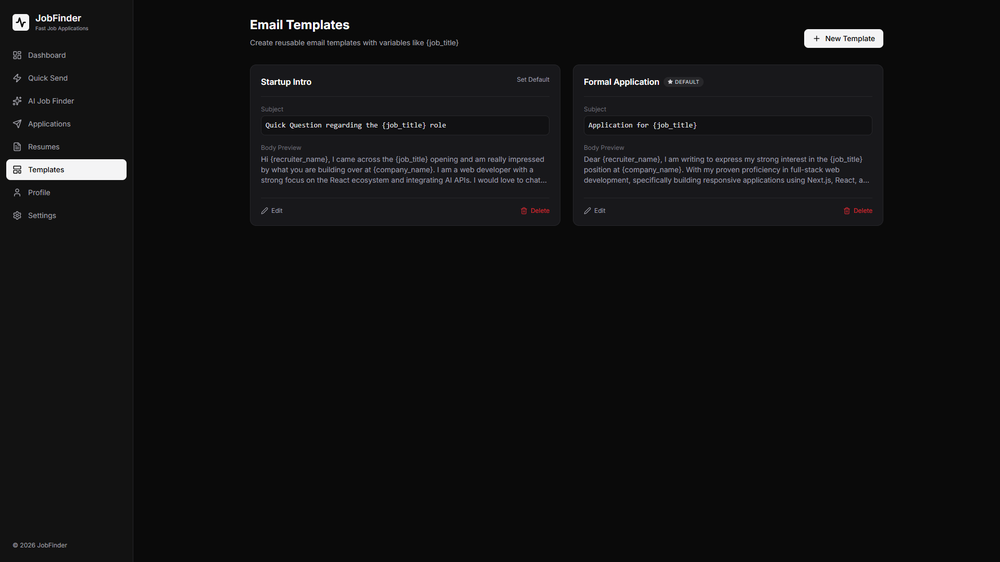
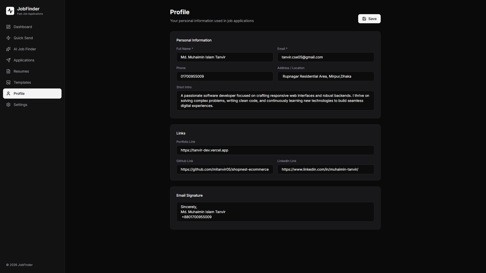
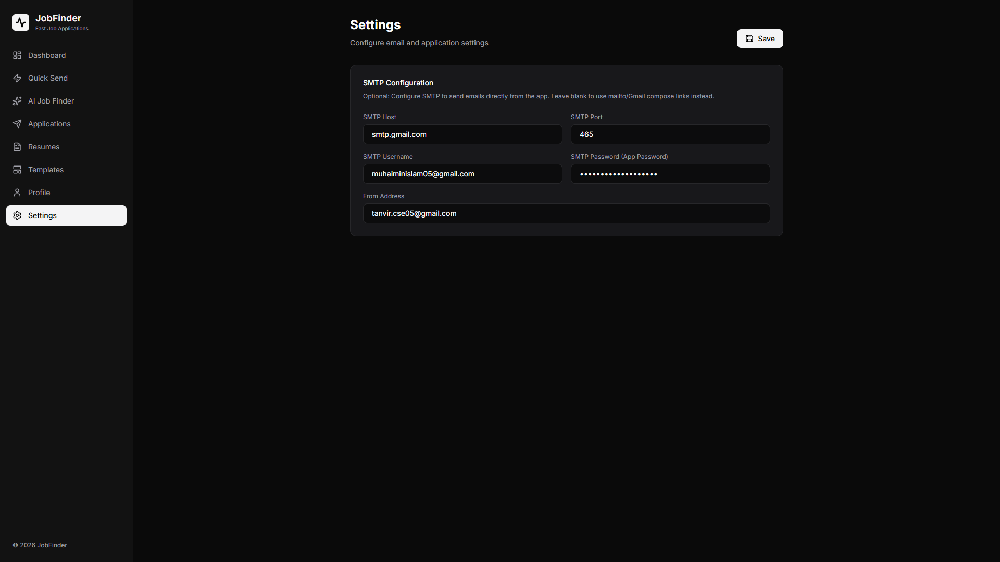

# 🤖 Job Finder AI - Smart Job Search & Application CRM

[Live Demo 🚀](https://job-finder-pro-ai.vercel.app)

Job Finder AI is a modern, full-stack job search and automation platform built with **Next.js 16**, **React 19**, and **TypeScript**. It leverages **Google Gemini AI** to discover job opportunities, extract recruiter emails, and streamline the entire application process through a powerful dashboard and CRM system.

---

## ✨ Features

- 🤖 **AI-Powered Job Search** – Uses Gemini AI to find job openings and extract recruiter emails automatically.
- 📊 **Application CRM Dashboard** – Track applications, monitor statuses, and avoid duplicate submissions.
- 📝 **Dynamic Email Templates** – Create reusable templates with smart variables like `{job_title}`, `{company_name}`, and `{recruiter_name}`.
- 📄 **Cloud Resume Management** – Upload and manage multiple PDF resumes using Cloudinary.
- ✉️ **One-Click Email Sending** – Send personalized job applications with attachments using NodeMailer (SMTP/Gmail).
- 👤 **Profile & Signature Injection** – Automatically append your signature, portfolio, and social links to emails.
- 🔍 **AI Job Simulation** – Generate realistic job listings for testing and automation workflows.
- 📱 **Responsive UI** – Fully optimized for desktop, tablet, and mobile devices.

---

## 🚀 Tech Stack

| Tech                     | Description                                      |
|--------------------------|--------------------------------------------------|
| **Next.js 16**           | Full-stack React framework (App Router)           |
| **React 19**             | Core UI library                                  |
| **TypeScript**           | Type-safe development                            |
| **Google Gemini API**    | AI for job search & recruiter email extraction   |
| **MongoDB + Mongoose**   | Database & ODM for storing applications          |
| **Cloudinary**           | Cloud storage for PDF resumes                    |
| **NodeMailer**           | Email sending via SMTP / Gmail                   |
| **Tailwind CSS v4**      | Utility-first modern styling                     |
| **Lucide React**         | Clean and modern icon library                    |
| **ESLint**               | Code linting and quality                         |

